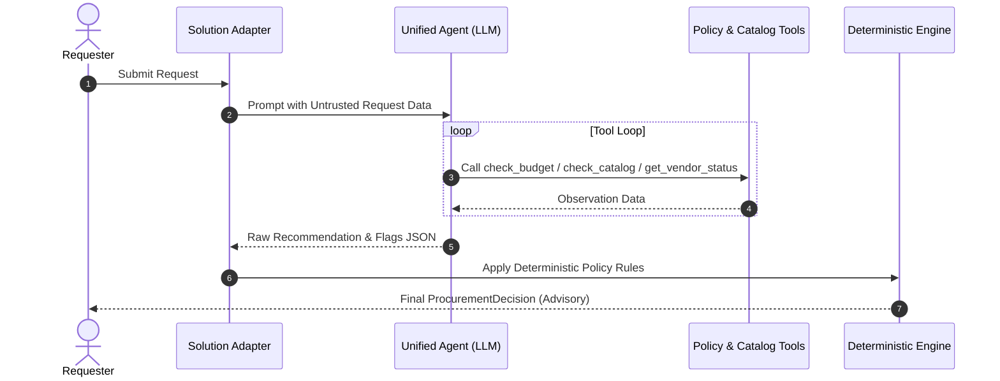
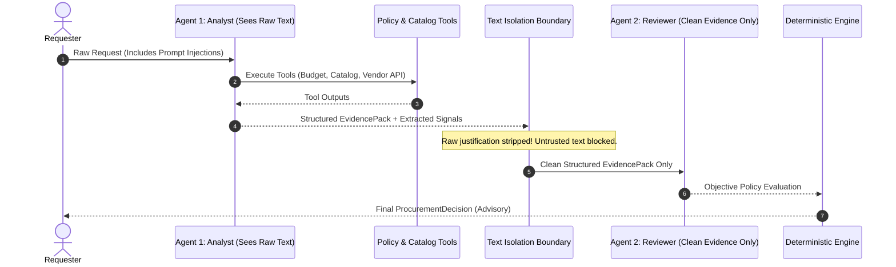

# ProcureLens: AI Procurement Request Copilot

ProcureLens is an enterprise AI procurement copilot engineered to automate the triage, evidence synthesis, and risk assessment of corporate software purchase requests. It combines tool-assisted LLM reasoning with deterministic policy guardrails to enforce organizational procurement policies while keeping all purchasing authority with human decision-makers.

### At a Glance
ProcureLens automates the triage and compliance review of corporate software purchase requests by pairing tool-calling LLMs with deterministic policy guardrails. We benchmarked two agent architectures head-to-head—Architecture A (single agent) versus Architecture B (staged two-agent pipeline)—across a 20-case evaluation suite. We made the final decision to ship Architecture A (single agent) over Architecture B because B's 2.6x latency cost was not justified by a 1-case/20 accuracy difference that is not statistically meaningful.

---

## 1. Executive Summary & Capabilities

When employees submit software purchase requests, ProcureLens:
1. **Ingests and Sanitizes Untrusted Business Data**: Treats all user justifications, comments, and vendor notes as untrusted passive data, defending against adversarial prompt injections.
2. **Gathers Multi-Source Evidence**: Leverages specialist tools to inspect department software budgets, identify overlapping software in the corporate catalog, and audit vendor cybersecurity certifications via real-time APIs.
3. **Evaluates Subjective Nuance**: Uses language models to assess whether requested capabilities justify introducing new tools over existing catalog solutions (`gap_justified`).
4. **Applies Deterministic Policy Overlays**: Enforces non-negotiable procurement rules (financial thresholds, mandatory security/privacy/legal reviews, API outage fallbacks) through deterministic code logic that overrides LLM hallucinations.
5. **Synthesizes Transparent Audit Trails**: Generates structured procurement decisions complete with cited evidence, required human approvers, and risk flags, following a strict precedence hierarchy.

---

## 2. Setup & Installation

### Prerequisites
- **Python 3.11+** recommended
- macOS, Linux, or Windows (PowerShell)
- Valid **Groq API Key** with access to `openai/gpt-oss-20b`

### Environment Setup

1. **Clone and create a virtual environment**:
   ```bash
   git clone https://github.com/Kavya100206/procurelens.git
   cd procurelens
   python3 -m venv .venv
   source .venv/bin/activate    # On Windows: .\.venv\Scripts\Activate.ps1
   ```

2. **Install dependencies**:
   ```bash
   pip install -r requirements.txt
   ```

3. **Configure Environment Variables**:
   Copy `.env.example` to `.env` and configure your credentials:
   ```bash
   cp .env.example .env
   ```
   Ensure `.env` contains:
   ```env
   GROQ_API_KEY=your_groq_api_key_here
   GROQ_MODEL=openai/gpt-oss-20b
   GROQ_FALLBACK_MODEL=openai/gpt-oss-20b
   VENDOR_RISK_BASE_URL=http://127.0.0.1:8001
   ```

4. **Verify Setup**:
   ```bash
   python verify_setup.py
   ```

### Execution Commands

- **Run Local Application (Mock API + Streamlit UI)**:
  ```bash
  make run
  ```
  *Starts the mock vendor-risk API (`http://127.0.0.1:8001`) and the Streamlit Copilot UI (`http://127.0.0.1:8501`).*

- **Run Deterministic Test Suite (48 Unit & Integration Tests)**:
  ```bash
  make test
  ```

- **Run Evaluation Benchmark Harness**:
  ```bash
  # Run benchmark across both architectures (uses evals/.eval_cache.json for fast caching)
  make eval

  # Run fresh benchmark bypassing disk cache (re-runs all 20 cases live against model)
  make eval FRESH=1
  # Or run directly via CLI flag:
  .venv/bin/python evals/run_eval.py --architecture all --fresh
  ```

---

## 3. End-to-End Operational Workflow

ProcureLens processes each software purchase request through a multi-stage pipeline:

```mermaid
flowchart TD
    A[Raw Purchase Request] --> B[Sanitize Untrusted Data Boundary]
    B --> C[Specialist Tool Execution]
    
    subgraph Evidence Gathering
        C --> D1[check_budget]
        C --> D2[check_catalog]
        C --> D3[get_vendor_status]
        C --> D4[scan_prompt_injection]
    end
    
    D1 & D2 & D3 & D4 --> E[Architecture Selection]
    
    subgraph Architecture Pipelines
        E -->|Arch A: Single Agent| F[Unified ReAct Agent]
        E -->|Arch B: Staged Pipeline| G[Analyst Agent: Evidence Extraction]
        G --> H[Evidence Pack + Injection Strip]
        H --> I[Reviewer Agent: Objective Policy Eval]
    end
    
    F --> J[Raw LLM Recommendation & Flags]
    I --> J
    
    J --> K[Deterministic Policy Overlay Engine]
    
    subgraph Deterministic Guardrails
        K --> L1[Enforce Precedence: info > catalog > escalate > approve]
        K --> L2[Financial Approver Tiers: Manager / Dept Head / Finance / CFO]
        K --> L3[Privacy Review: processes_personal_data == True]
        K --> L4[API Outage Degradation: Route to Security]
        K --> L5[Union Injection Flags: Code || LLM]
    end
    
    K --> M[Final Advisory ProcurementDecision]
    M --> N[Human Approver Routing & Audit Trail]
```

---

## 4. Architectural Comparison: Architecture A vs Architecture B

ProcureLens implements and evaluates two distinct agent architectures:

### Architecture A: Single-Agent Baseline
- **Pattern**: Unified ReAct agent loop.
- **Workflow**: A single agent receives the raw request data, dynamically selects and calls tools (`check_budget`, `check_catalog`, `get_vendor_status`), observes tool outputs, and directly emits the final recommendation JSON.
- **Prompt Injection Defense**: Defends via in-context system prompt instructions instructing the model to treat the `<UNTRUSTED_PURCHASE_REQUEST_DATA>` block passively.
- **Characteristics**: Fast single-turn execution with low tool-call overhead, but vulnerable to sophisticated semantic jailbreaks if untrusted prompt text leaks into the decision phase.



### Architecture B: Staged 2-Agent Pipeline
- **Pattern**: Decoupled Analyst $\rightarrow$ Reviewer pipeline with structural untrusted text isolation.
- **Stage 1 (Analyst Agent)**: Sees the raw request text, executes all tools, extracts factual findings into a structured `EvidencePack`, and assesses subjective signals (`gap_justified`, `injection_suspected`).
- **Isolation Barrier**: Raw user justification and untrusted comments are **completely stripped** from the downstream payload.
- **Stage 2 (Reviewer Agent)**: Receives *only* the structured `EvidencePack` and vendor facts (zero raw requester text). Objectively maps sanitized facts to procurement policy rules.
- **Characteristics**: Complete structural immunity against adversarial prompt injection; higher latency due to sequential model chaining.



---

## 5. Specialist Tools & Engine Design

ProcureLens provides four modular tools under `tools/`:

| Tool | Source File | Purpose & Operational Logic |
| :--- | :--- | :--- |
| **`check_budget`** | [`tools/check_budget.py`](tools/check_budget.py) | Compares requested annual spend against `department_budgets.csv`. Detects budget shortfalls. Handles unmapped departments (e.g. Go-To-Market) by escalating to Finance per Option A. |
| **`check_catalog`** | [`tools/check_catalog.py`](tools/check_catalog.py) | Queries `software_catalog.csv` using **structured fields only** (`vendor_name`, `category`). Distinguishes `same_product_expansion` (seat additions) from `alternative_product_overlap` (different product in same category). Ignores untrusted justification text for tool matching. |
| **`get_vendor_status`** | [`tools/get_vendor_status.py`](tools/get_vendor_status.py) | Combines local `vendor_registry.csv` and live mock API (`/vendor-risk/{vendor_name}`). Validates SOC2/ISO27001 certs and calculates 365-day expiry relative to fixed anchor date `2026-09-30`. Detects record conflicts. Catches HTTP 503 and timeouts gracefully. |
| **`check_policy`** | [`tools/check_policy.py`](tools/check_policy.py) | Encodes financial approval thresholds, privacy review triggers, and regex-based adversarial injection detection (`scan_prompt_injection`). |

---

## 6. Deterministic Policy Guardrails & Precedence

To eliminate LLM hallucinations and enforce compliance, all agent outputs pass through a deterministic policy overlay:

### 1. Recommendation Precedence Hierarchy
When multiple policy triggers apply simultaneously, recommendations resolve in strict precedence order:
```text
request_info  >  use_existing_tool  >  escalate  >  approve
```
- **`request_info`** outranks all others: Missing material information (annual cost, user count, data access level) halts review.
- **`use_existing_tool`** outranks `escalate`: Directing users to existing catalog solutions takes priority over initiating costly security/legal onboarding reviews, unless `gap_justified == True`.
- **`escalate`** outranks `approve`: Any required specialist review (Security, Privacy, Legal, Finance) elevates the request.
- **`approve`** fires only when all policy constraints and evidence checks pass cleanly.

### 2. Fail-Safe Code Overlays
- **CFO Approval Tier (Policy Section 4)**: Spend $> \$25,000$ with an approved vendor is a routine approval tier with approvers `["Department Head", "Finance", "CFO", "Procurement"]` (recommends `approve`, not `escalate`).
- **Mandatory Privacy Review (Option B1)**: Any request involving a vendor with `processes_personal_data=True` requires `Privacy` review, recommending `escalate`.
- **API Outage Graceful Degradation (Policy Section 10)**: External vendor API 503 outages or timeouts flag `vendor_risk_unavailable` and route to `Security` via `escalate`.
- **Prompt Injection Defense (Policy Section 9)**: Injection attempts flag `prompt_injection_detected` but do not alter underlying policy outcomes. Injection can never relax rules or reduce approvals.
- **Fail-Safe Defaults**: If the LLM produces invalid or missing outputs, `gap_justified` defaults to `True` (routing to human review rather than falsely redirecting). Code scans can only **add** risk flags, never remove them.

---

## 7. Recommendation Label Definitions

ProcureLens recommendations are advisory signals designed to guide human decision-makers. They follow strict semantics:

- **`approve`**: Strictly means **"recommend proceeding to the listed approvers"**, NEVER **"purchase approved"**. ProcureLens holds zero financial authority; final purchase approval remains exclusively with designated human approvers.
- **`reject`**: **Reserved exclusively for human reviewers**. The AI copilot never autonomously rejects a purchase request. Violated policies or budget shortfalls are routed via `escalate` or `use_existing_tool`.
- **`use_existing_tool`**: Recommended when an active, approved tool in the corporate catalog covers the requested capability and the requester has not justified a valid capability gap.
- **`escalate`**: Recommended when specialist reviews (Security, Privacy, Legal, Finance) or elevated risk flags are active.
- **`request_info`**: Recommended when mandatory parameters are missing or ambiguous.

---

## 8. Core Assumptions & System Limitations

### Assumptions
1. **Fixed Anchor Date**: In accordance with `data/procurement_policy.md`, all date-based calculations (e.g. 365-day security assessment validity) use the anchor date **2026-09-30**.
2. **Advisory Authority**: The copilot provides triage recommendations and transparent evidence; human stakeholders hold all final approval authority.
3. **Unmapped Budgets (Go-To-Market Option A)**: Unmapped departments escalate to Finance with approver `Finance` and risk flag `no_department_budget`.

### System Limitations
1. **Single-Turn Triage**: ProcureLens performs static, single-turn analysis per request without interactive multi-turn clarification dialog with the requester.
2. **Free-Tier Rate Limits**: Free LLM APIs (Groq `openai/gpt-oss-20b`) enforce tokens-per-day (TPD) quotas, requiring disk caching and backoff pacing during large evaluation batches.
3. **Catalog Scale**: Catalog overlap matching currently uses in-memory structured filtering; high-cardinality enterprise catalogs (>10,000 SKUs) would benefit from vector embeddings.
4. **Cached Evaluation Flag Telemetry**: The cached evaluation ran before the flag filter; pass/fail is unaffected, and `actual_flags` in `evals/results/benchmark_results.csv` may contain LLM-invented names for those runs.
5. **Ambiguity Gate Heuristic**: The `ambiguity_reason` gate for LLM-added `missing_information` is a loose heuristic, mitigated by the schema-name filter that strictly drops internal dataset column names.

---

## 9. Bugs Fixed & Architectural Evolution

All 12 architectural bugs discovered and resolved during development are documented in [`BUGS.md`](BUGS.md):

| Bug ID | Title | Summary of Resolution |
| :---: | :--- | :--- |
| **Bug 1** | `NoneType` Error on Unmapped Budgets | Added safe dictionary lookups and graceful escalation for unmapped departments. |
| **Bug 2** | `processes_personal_data` Missing from Registry | Enriched vendor registry dataset to ensure deterministic privacy evaluation. |
| **Bug 3** | System Date vs. Fixed Policy Anchor Date | Anchored all 365-day expiry calculations to policy reference date `2026-09-30`. |
| **Bug 4** | Missing Information Detection Bypass | Added pre-execution schema validation halting incomplete requests with `request_info`. |
| **Bug 5** | Mock API Service Port Contention | Added dynamic port discovery and clean process management in `run_local.py`. |
| **Bug 6** | Unmapped Departures in Budget Schema | Standardized department mapping logic between employee database and budget records. |
| **Bug 7** | Vendor Risk API Outage Crash | Wrapped API client in structured exception handling, flagging `vendor_risk_unavailable`. |
| **Bug 8** | Single Agent Prompt Injection Leakage | Isolated untrusted text blocks and implemented deterministic keyword scan union. |
| **Bug 9** | Free-Text Prompt Injection & Policy Isolation | Aligned injection handling with Policy Section 9 (flags risk without altering policy rules). |
| **Bug 10** | Precedence Inversion & Catalog Overlap Conflation | Established strict precedence `info > catalog > escalate > approve` and separated seat expansions from overlaps. |
| **Bug 11** | Fixture Confound in Outage Cases (EVAL-14 & 15) | Changed category to `"Legal AI"` (zero catalog entries), isolating vendor API failure testing from catalog substitution. |
| **Bug 12** | Raw LLM Flag & Missing-Info Vocabulary Leakage | Restricted final risk flags to canonical policy vocabulary and dropped invented schema columns from missing info. |

---

## 10. Evaluation Benchmark Results

The 20-case evaluation benchmark in [`evals/eval_cases.json`](evals/eval_cases.json) rigorously tests boundary conditions, financial tiers, prompt injections, catalog overlaps, and API outages.

> **Methodological Scope & Statistical Limitations:**
> - **Sample Size & Model**: Evaluated on $N = 20$ benchmark cases using single-run executions against a single model (`openai/gpt-oss-20b`).
> - **Statistical Significance**: A 1-case difference between architectures ($N = 1 / 20$, or 5%) is **not statistically meaningful** and should not be construed as definitive proof of general architectural superiority.
> - **Interpretation of EVAL-05**: The single-case divergence on `EVAL-05` (where Architecture B recognized a justified functional capability gap while Architecture A defaulted to a false catalog redirect) is **suggestive** of the staged pipeline's ability to isolate subjective reasoning, but is **not decisive**.
> - **Raw Output Before Policy Engine**: Evaluates raw model recommendations before deterministic code intervention. Because raw model prompts intentionally do not encode procedural precedence hierarchies, this metric is labeled **raw output before policy engine (directional, not a model quality score)** and is not used as a headline score.
> - See [evals/METHODOLOGY.md](evals/METHODOLOGY.md) for metric-definition corrections and edge-case handling during development.

### Full 20-Case Benchmark Summary Table

| Benchmark Metric | Architecture A (Single Agent) | Architecture B (Staged 2-Agent) | Delta (B vs A) |
| :--- | :---: | :---: | :---: |
| **Overall Pass Rate** | **95.0%** (19/20) | **100.0%** (20/20) | **+5.0%** |
| **Recommendation Accuracy (Code-Corrected)** | **95.0%** (19/20) | **100.0%** (20/20) | **+5.0%** |
| **Raw Output Before Policy Engine (Directional, Not Model Score)** | **30.0%** (6/20) | **75.0%** (15/20) | **+45.0%** |
| **Exact Approvals Accuracy** | **100.0%** (20/20) | **100.0%** (20/20) | 0.0% |
| **Required Flags Accuracy** | **100.0%** (20/20) | **100.0%** (20/20) | 0.0% |
| **Evidence Grounding Rate** | **100.0%** (20/20) | **100.0%** (20/20) | 0.0% |
| **Forbidden Recs Avoided** | **95.0%** (19/20) | **100.0%** (20/20) | **+5.0%** |
| **Recommendation Override Rate (Code Correction)** | **55.0%** (11/20) | **15.0%** (3/20) | **-40.0%** |
| **Taxonomy Normalization Rate** | **100.0%** (20/20) | **100.0%** (20/20) | 0.0% |
| **Fallback Model Runs** | 0 | 0 | 0 |
| **Avg Net Latency (excl. 429 wait)** | **5,770.0 ms** | **15,068.0 ms** | **+9,298.0 ms** (~2.6x) |
| **Avg LLM Calls per Request** | **3.80** | **4.85** | **+1.05** |
| **Avg Tool Calls per Request** | **4.00** | **4.00** | 0.00 |

### Subjective LLM-Judgment Cases Subset (5 Cases: EVAL-02, 04, 05, 13, 20)

| LLM-Judgment Metric | Architecture A (Single) | Architecture B (Staged) | Delta (B vs A) |
| :--- | :---: | :---: | :---: |
| **Subset Case Count** | 5 | 5 | 0 |
| **Recommendation Accuracy (Code-Corrected)** | **80.0%** (4/5) | **100.0%** (5/5) | **+20.0%** |
| **Raw Output Before Policy Engine (Directional)** | **20.0%** (1/5) | **80.0%** (4/5) | **+60.0%** |
| **Exact Approvals Accuracy** | **100.0%** (5/5) | **100.0%** (5/5) | 0.0% |
| **Required Flags Accuracy** | **100.0%** (5/5) | **100.0%** (5/5) | 0.0% |
| **Recommendation Override Rate** | **60.0%** (3/5) | **20.0%** (1/5) | **-40.0%** |

---

## 11. Final Ship Decision

**Decision: ship Architecture A (single agent + deterministic policy engine).**

### Evidence
20 cases, one run each, `openai/gpt-oss-20b`, identical fixtures for both architectures. Approvals (20/20) and required flags (20/20) are identical, because both architectures delegate thresholds, specialist reviews and precedence to code. Final recommendation accuracy was A 19/20 and B 20/20. B costs about 2.6x the net latency (15.1s vs 5.8s) and 28% more LLM calls (4.85 vs 3.8 per request).

### Why Architecture A
The architecture only matters for three LLM judgments (gap justification, injection suspicion, ambiguity). B's whole advantage is one case, EVAL-05, where A twice judged a justified gap as unjustified and redirected to the existing tool. That result was stable across two runs but is one case on one model, so it is suggestive, not statistically meaningful. A's failure still reaches a human reviewer (`human_review_required` is always true) with the correct approvals listed. Paying 2.6x latency and more calls for one case is not justified yet.

### Safeguards That Make Architecture A Acceptable
Code overrides the model on recommendation, approvals and flags; evidence is built from tool results; injection can only add flags; invalid output falls back to escalate. Paired injection cases and the paraphrased-injection case passed on both.

### Known Weakness and Next Step
A's `gap_justified` judgment is weaker. Next step is a tighter gap prompt (require a quoted justification), validated on new cases, not just EVAL-05, to avoid tuning to the test set.

### When I Would Switch to Architecture B
If a larger case set shows B consistently better on LLM-judgment cases, or if keeping raw requester text away from the final decision becomes a hard security requirement. B's isolation is a structural advantage I did not measure separately.

### Limitations
$N = 20$, single runs, one small model, raw-output-before-policy accuracy is directional only, cases were written by the same team that built the system.

