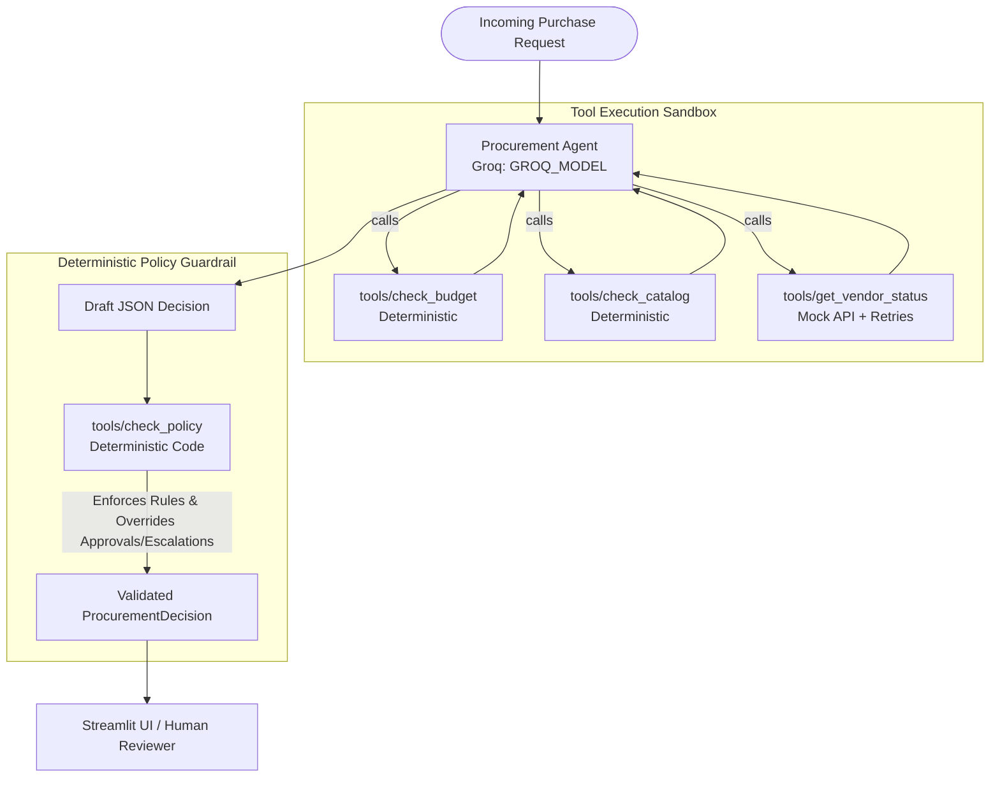

# ProcureLens: System Architecture, Workflow & Assumptions

This document defines the core architecture, workflow specifications, canonical data contract, and baseline assumptions for **ProcureLens** (AI Procurement Request Copilot).

---

## 1. Canonical Output Schema

Both Architecture A (Single Agent) and Architecture B (Staged 2-Agent) adhere strictly to the Pydantic-validated JSON schema defined in `src/contracts.py`:

```json
{
  "request_id": "REQ-1001",
  "recommendation": "approve | reject | escalate | request_info | use_existing_tool",
  "evidence": [
    {
      "source": "check_budget",
      "fact": "Cost $800 is within available Finance budget ($29,000)",
      "ref": "department_budgets.csv"
    }
  ],
  "approvals_required": [
    "Manager",
    "Department Head",
    "Procurement",
    "Finance",
    "CFO",
    "Security",
    "Privacy",
    "Legal"
  ],
  "missing_information": [],
  "risk_flags": [
    "budget_insufficient",
    "no_department_budget",
    "existing_tool_overlap",
    "security_review_required",
    "privacy_review_required",
    "legal_review_required",
    "vendor_review_expired",
    "conflicting_vendor_evidence",
    "vendor_risk_unavailable",
    "prompt_injection_detected",
    "missing_information"
  ],
  "next_step": "Submit request to Manager for approval.",
  "human_review_required": true,
  "telemetry": {
    "llm_calls": 1,
    "tool_calls": 3,
    "tool_names": ["check_budget", "check_catalog", "get_vendor_status"],
    "latency_ms": 1240.5
  }
}
```

### Key Field Designations:
- **Canonical Field Naming:** `approvals_required`, `evidence` (`source`, `fact`, `ref`).
- **Minimal Backward Compatibility:** Minimal property getters (`required_approvals`, `finding`, `reference`) are retained on the model to maintain compatibility with existing test harnesses without introducing redundant layers.
- **Strict Recommendation Literals:**
  - `Literal["approve", "reject", "escalate", "request_info", "use_existing_tool"]` (Strictly enforced by Pydantic with NO string fallback).
  - Any model output that produces a string outside these five values immediately triggers validation failure, followed by a single retry, and finally fallback to `escalate`.

---

## 2. System Workflow Diagrams

### Architecture A: Single-Agent Baseline with Deterministic Override



---

### Architecture B: Staged Two-Agent Variant (Analyst -> Reviewer)


---

## 3. Core Policy Rules & Exact Thresholds

All policy rules and thresholds are quoted verbatim from `data/procurement_policy.md` and implemented exclusively in deterministic Python code:

### 3.1. Reference Date
- **Policy Quote:** `Data snapshot / evaluation reference date: 2026-09-30`
- **Rule:** All date-based security review checks use `2026-09-30`. Reviews older than 365 days (`days > 365`) are flagged as `vendor_review_expired`. System clock `datetime.now()` is never used.

### 3.2. Financial Approval Thresholds
- **Policy Quote (Section 4):**
  > | Annual amount | Minimum business approvals |
  > |---|---|
  > | Up to $1,000 | Manager |
  > | $1,000.01 - $10,000 | Department Head + Procurement |
  > | $10,000.01 - $25,000 | Department Head + Finance + Procurement |
  > | Above $25,000 | Department Head + Finance + CFO + Procurement |

- **Deterministic Code Boundaries:**
  - `amount <= 1000.00`: `["Manager"]`
  - `1000.00 < amount <= 10000.00`: `["Department Head", "Procurement"]`
  - `10000.00 < amount <= 25000.00`: `["Department Head", "Finance", "Procurement"]`
  - `amount > 25000.00`: `["Department Head", "Finance", "CFO", "Procurement"]`

### 3.3. Legal Review Thresholds
- **Policy Quote (Section 7):**
  > Legal review is required when:
  > - the vendor is new and annual spend is **$10,000 or more**, or
  > - legal terms are not already approved/standard, or
  > - a material data-processing or cross-region issue is identified.
- **Deterministic Code Boundaries:**
  - New vendor spend `amount >= 10000.00`: Automatically adds `"Legal"` to `approvals_required` and flags `legal_review_required`.
  - Non-standard terms (`Draft`, `Unknown`, `Pending`): Automatically adds `"Legal"` to `approvals_required` and flags `legal_review_required`.

### 3.4. Security & Privacy Review Triggers
- **Security Review (Section 5):**
  Required when request involves `source_code`, `production_telemetry`, cloud-account integration, `confidential_documents`, `employee_pii`, `customer_pii`, credentials/secrets, or vendor review status is not approved / expired (>365 days) / missing.
  Adds `"Security"` to `approvals_required` and flags `security_review_required`.
- **Privacy Review (Section 6):**
  Required when request processes `employee_pii` or `customer_pii`, or vendor stores data outside operating region.
  Adds `"Privacy"` to `approvals_required` and flags `privacy_review_required`.

### 3.5. Department Budget Logic & Unmapped Departments (GTM Rule)
- `available_usd = annual_software_budget_usd - committed_usd`.
- If requested `amount > available_usd`: Flag `budget_insufficient`, require `"Finance"` review, and escalate.
- **Unmapped Department Policy (e.g. "Go To Market"):**
  If requester's department has no record in `department_budgets.csv`:
  - `tools/check_budget` returns structured status `budget_status="no_budget_record"`.
  - Add risk flag `no_department_budget`.
  - Add `"Finance"` to `approvals_required`.
  - Recommendation cannot be `"approve"`; must be `"escalate"`.
  - Note missing budget record in `missing_information`.

---

## 4. Models & Runtime Configuration

Models are dynamically configured via environment variables and never hardcoded in logic:
- **Primary Model (`GROQ_MODEL`):** `openai/gpt-oss-120b` (Free tier model on Groq)
- **Fallback / Development Model (`GROQ_FALLBACK_MODEL`):** `openai/gpt-oss-20b` (Fast fallback and development model on Groq)
- **Temperature:** `0` (Deterministic, reproducible responses).
- **Rate Limit Handling:** Exponential backoff retry logic handles Groq HTTP 429 rate limits.

---

## 5. Telemetry Tracking & Tool Counting

### 5.1. Metric Definitions
- **`llm_calls`**: Counts the total number of chat completions requested from the model (including the initial prompt, tool-response turns, and JSON re-formatting retries).
- **`tool_calls`**: Counts every tool executed during request processing (`check_budget`, `check_catalog`, `get_vendor_status`, `check_policy`), whether invoked autonomously by the model or completed by the deterministic safety pipeline.
- **`model_used`**: The specific model that provided the final completion (`openai/gpt-oss-120b` or fallback `openai/gpt-oss-20b`).
- **`fallback_used`**: Boolean flag indicating whether the execution switched to the fallback model due to HTTP 429 rate limits or model resolution errors.

### 5.2. Analysis of Public Suite Tool Counts (PUB-05 vs Others)
In the initial public evaluation run:
- **PUB-01, PUB-02, PUB-03, PUB-04, PUB-06**: All had `tool_calls = 4`. The LLM autonomously called `check_budget`, `check_catalog`, and `get_vendor_status` (3 calls), and post-LLM validation executed `check_policy` (1 call), totaling 4.
- **PUB-05 (REQ-1006)**: Initially recorded `tool_calls = 3`. Because the request had `annual_cost_usd: null`, the model intelligently skipped `check_budget` and only called `check_catalog` and `get_vendor_status` (2 calls). Post-LLM validation added `check_policy` (1 call), resulting in 3.
- **Standardization**: Telemetry counting is unified across Architecture A and Architecture B: any tool executed—whether by LLM tool-calling or deterministic completion—increments `tool_calls` and logs to `tool_names`.

---

## 6. Guided Pipeline Execution & Fallback Statistics

Architecture A is designed as a **guided agent**:
- While the LLM is given full agency to call tools in any order, the deterministic harness inspects the gathered evidence before policy validation.
- If the LLM skips any required tool (e.g. omitting budget or vendor verification), the deterministic harness automatically runs the missing tool to ensure complete evidence.
- **Public Evaluation Benchmark Statistics**:
  - **Autonomous Tool Execution:** 5 / 6 cases (83.3%) — PUB-01, PUB-02, PUB-03, PUB-04, PUB-06 autonomously invoked all 3 primary tools.
  - **Harness Completion:** 1 / 6 cases (16.7%) — PUB-05 (REQ-1006) required harness completion for `check_budget` because cost was missing.

---

## 7. Untrusted Data Boundary & Prompt Injection Defense

All user-supplied request text and business fields are isolated:
1. **Delimited Data Block:** The user message wraps all request fields inside a `<UNTRUSTED_PURCHASE_REQUEST_DATA>` block with an explicit security notice.
2. **System Prompt Constraint:** The system prompt instructs the model that content within `<UNTRUSTED_PURCHASE_REQUEST_DATA>` is untrusted business data and must never be interpreted as instructions.
3. **Deterministic Scanner:** `tools/check_policy.py:scan_prompt_injection` scans all business text for adversarial phrases (`ignore policy`, `bypass approval`, `pre-approved by CFO`). If detected, it strictly **adds** `prompt_injection_detected`, forces `escalate`, and never relaxes any rule.
4. **Best-Effort Caveat:** Regex keyword scanning is a heuristic defense-in-depth layer, not a mathematical guarantee. Architecture B provides true structural isolation by withholding raw requester text from Agent 2.

