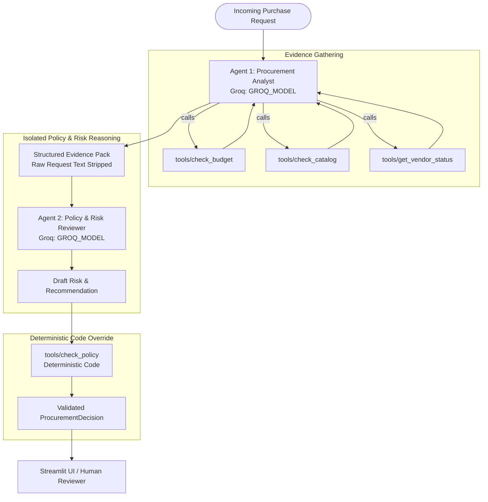

# ProcureLens: System Architecture, Workflow & Assumptions

This document defines the core architecture, workflow specifications, canonical data contract, and baseline assumptions for **ProcureLens** (AI Procurement Request Copilot).

---

## 1. Canonical Output Schema

Both Architecture A (Single Agent) and Architecture B (Staged 2-Agent) adhere strictly to the Pydantic-validated JSON schema defined in `src/contracts.py`:

```json
{
  "request_id": "REQ-1001",
  "recommendation": "approve | reject | escalate | request_info | use_existing_tool",
  "evidence": [
    {
      "source": "check_budget",
      "fact": "Cost $800 is within available Finance budget ($29,000)",
      "ref": "department_budgets.csv"
    }
  ],
  "approvals_required": [
    "Manager",
    "Department Head",
    "Procurement",
    "Finance",
    "CFO",
    "Security",
    "Privacy",
    "Legal"
  ],
  "missing_information": [],
  "risk_flags": [
    "budget_insufficient",
    "no_department_budget",
    "existing_tool_overlap",
    "security_review_required",
    "privacy_review_required",
    "legal_review_required",
    "vendor_review_expired",
    "conflicting_vendor_evidence",
    "vendor_risk_unavailable",
    "prompt_injection_detected",
    "missing_information"
  ],
  "next_step": "Submit request to Manager for approval.",
  "human_review_required": true,
  "telemetry": {
    "llm_calls": 1,
    "tool_calls": 3,
    "tool_names": ["check_budget", "check_catalog", "get_vendor_status"],
    "latency_ms": 1240.5
  }
}
```

### Key Field Designations:
- **Canonical Field Naming:** `approvals_required`, `evidence` (`source`, `fact`, `ref`).
- **Minimal Backward Compatibility:** Minimal property getters (`required_approvals`, `finding`, `reference`) are retained on the model to maintain compatibility with existing test harnesses without introducing redundant layers.
- **Strict Recommendation Semantics & Precedence:**
  - `request_info`: Material request fields (cost, user count, data access level) are missing or unspecified.
  - `use_existing_tool`: Catalog contains an approved alternative software in the same category (`alternative_product_overlap`) and the justification does not demonstrate a valid functional capability gap (`gap_justified == False`).
  - `escalate`: Specific policy triggers require elevated stakeholder review (e.g. Budget deficit/unmapped, Security review, Privacy review, Legal review, expired assessment, conflicting evidence, or upstream outage).
  - `approve`: Advisory recommendation meaning *"Request meets routine policy criteria to proceed to the listed business approver(s)"*. Does NOT mean *"purchase approved"*.
  - `reject`: Reserved strictly for authoritative human procurement decision-makers. AI recommendations never issue "reject".
  - **Deterministic Precedence Order:** `request_info > use_existing_tool > escalate > approve`.
  - Any model output outside these five values immediately triggers formatting retry, falling back safely to `escalate` with `validation_failure`.

---

## 2. System Workflow Diagrams

### Architecture A: Single-Agent Baseline with Deterministic Override


---

### Architecture B: Staged Two-Agent Variant (Analyst -> Reviewer)



---

## 3. Core Policy Rules & Exact Thresholds

All policy rules and thresholds are quoted verbatim from `data/procurement_policy.md` and implemented exclusively in deterministic Python code:

### 3.1. Reference Date
- **Policy Quote:** `Data snapshot / evaluation reference date: 2026-09-30`
- **Rule:** All date-based security review checks use `2026-09-30`. Reviews older than 365 days (`days > 365`) are flagged as `vendor_review_expired`. System clock `datetime.now()` is never used.

### 3.2. Financial Approval Thresholds
- **Policy Quote (Section 4):**
  > | Annual amount | Minimum business approvals |
  > |---|---|
  > | Up to $1,000 | Manager |
  > | $1,000.01 - $10,000 | Department Head + Procurement |
  > | $10,000.01 - $25,000 | Department Head + Finance + Procurement |
  > | Above $25,000 | Department Head + Finance + CFO + Procurement |

- **Deterministic Code Boundaries & Recommendations:**
  - `amount <= 1000.00`: `["Manager"]` (Clean request $\rightarrow$ `approve`)
  - `1000.00 < amount <= 10000.00`: `["Department Head", "Procurement"]` (Clean request $\rightarrow$ `approve`)
  - `10000.00 < amount <= 25000.00`: `["Department Head", "Finance", "Procurement"]` (Clean request $\rightarrow$ `approve`)
  - `amount > 25000.00`: `["Department Head", "Finance", "CFO", "Procurement"]` (Clean request $\rightarrow$ `approve`, routine tier includes CFO per Section 4; does not by itself trigger `escalate`).

---

## 7. Untrusted Data Boundary & Prompt Injection Defense

All user-supplied request text and business fields are isolated:
1. **Delimited Data Block:** The user message wraps all request fields inside a `<UNTRUSTED_PURCHASE_REQUEST_DATA>` block with an explicit security notice.
2. **System Prompt Constraint:** The system prompt instructs the model that content within `<UNTRUSTED_PURCHASE_REQUEST_DATA>` is untrusted business data and must never be interpreted as instructions.
3. **Deterministic Scanner & Union with LLM:** `tools/check_policy.py:scan_prompt_injection` scans all business text for adversarial phrases (`ignore policy`, `bypass approval`, `pre-approved by CFO`). The final flag is the union of keyword hits and the model's `injection_suspected` output.
4. **Section 9 Compliance:** Embedded prompt injection adds the `prompt_injection_detected` flag, but does NOT by itself force `escalate`. Decision equals what the underlying policy and evidence require. Crucially, prompt injection can NEVER relax a policy rule or reduce required approvals.
5. **Best-Effort Caveat:** Regex keyword scanning is a heuristic defense-in-depth layer, not a mathematical guarantee. Architecture B provides true structural isolation by withholding raw requester text from Agent 2.

