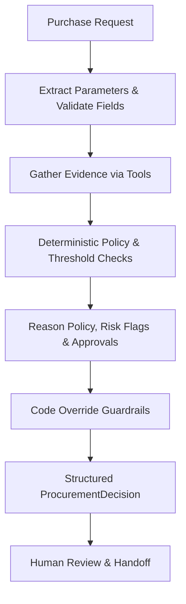

# Workflow / Architecture Notes

## System Flow

## Agent Responsibilities
- **Architecture A (Single Agent):** One Groq LLM tool-calling loop gathers evidence and produces a draft decision. Code overrides approvals and escalations using deterministic policy logic.
- **Architecture B (Staged 2-Agent):**
  - **Agent 1 (Procurement Analyst):** Extracts needs, queries tools, and compiles a structured Evidence Pack.
  - **Agent 2 (Policy/Risk Reviewer):** Receives *only* the structured evidence pack (zero raw prompt text) to eliminate injection vectors and verify compliance.
  - **Deterministic Code Guardrail:** Enforces all policy thresholds, overrides approvals, and verifies risk flags.

## Deterministic Code vs Model-Driven
- **Deterministic (Code):**
  - Budget calculations and shortfall checks (`tools/check_budget.py`).
  - Catalog matching for existing solutions (`tools/check_catalog.py`).
  - Stale vendor review and expiration detection (`tools/get_vendor_status.py`).
  - Financial approval thresholds and mandatory reviews (`tools/check_policy.py`).
  - Override of LLM approvals and escalation routing.
- **Model-Driven (LLM):**
  - Interpreting unstructured natural language request justifications.
  - Formulating explanatory summaries and specific operational next steps.
  - Synthesizing nuanced context into recommendations.

## Stop & Escalation Conditions
- Missing mandatory fields -> `request_info`.
- Budget exceeded -> `budget_insufficient` + escalate to Finance.
- Vendor unapproved / expired / unavailable -> `escalate` + Security review.
- Cost >= $10,000 with new vendor -> Legal review.
- Prompt injection attempt detected -> Flag `prompt_injection_detected`, ignore malicious instructions, enforce true policy.
